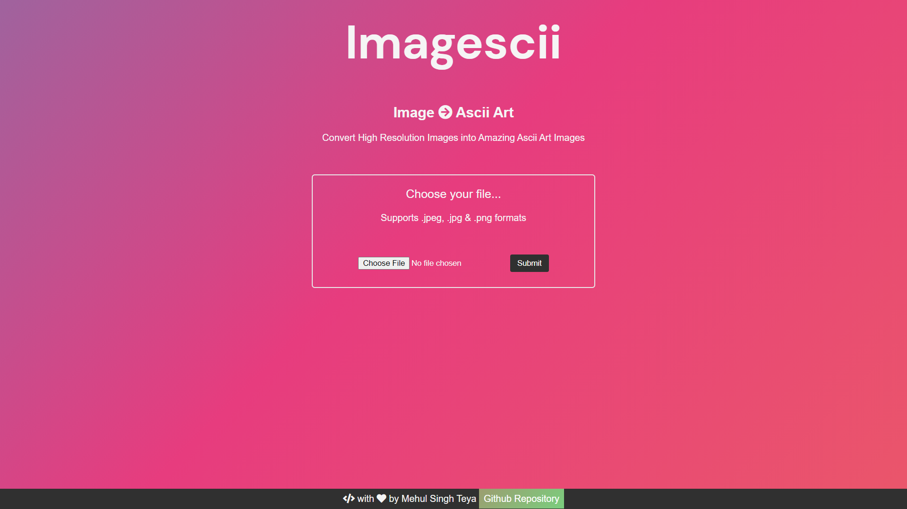
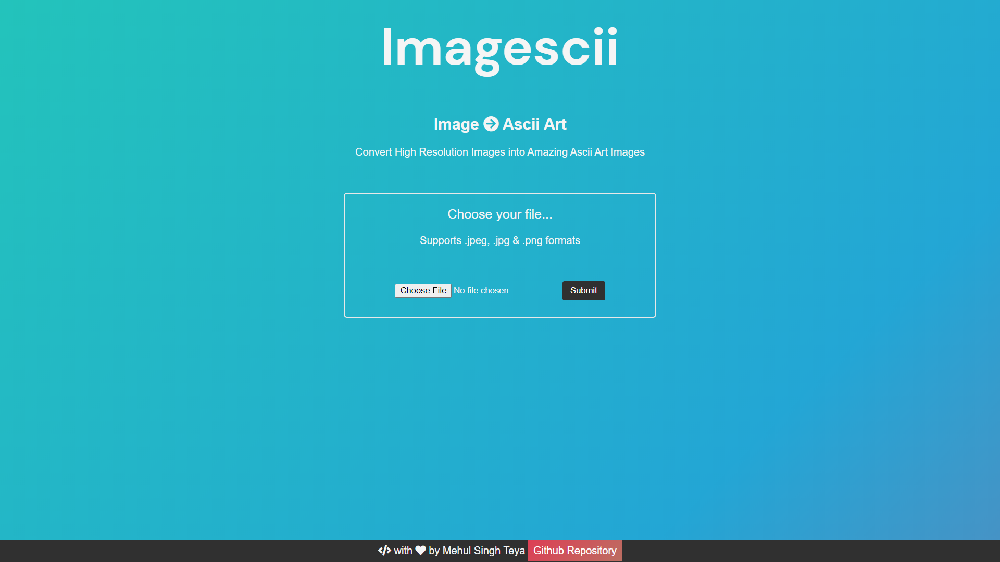
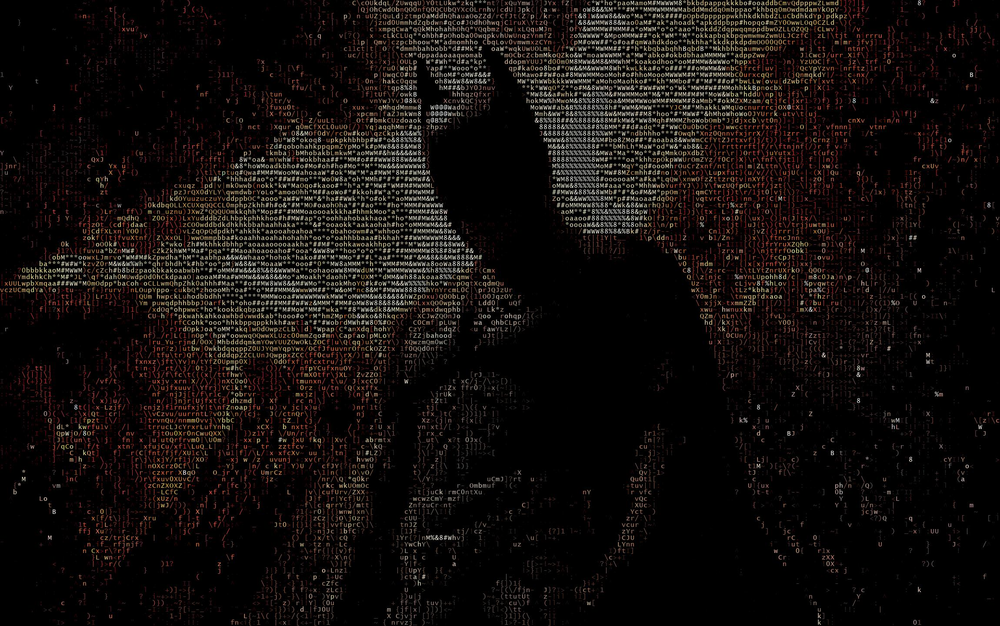
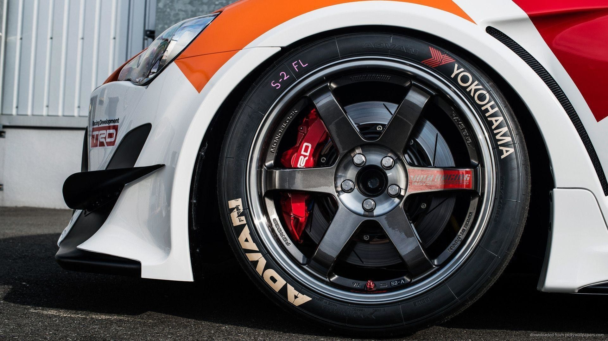
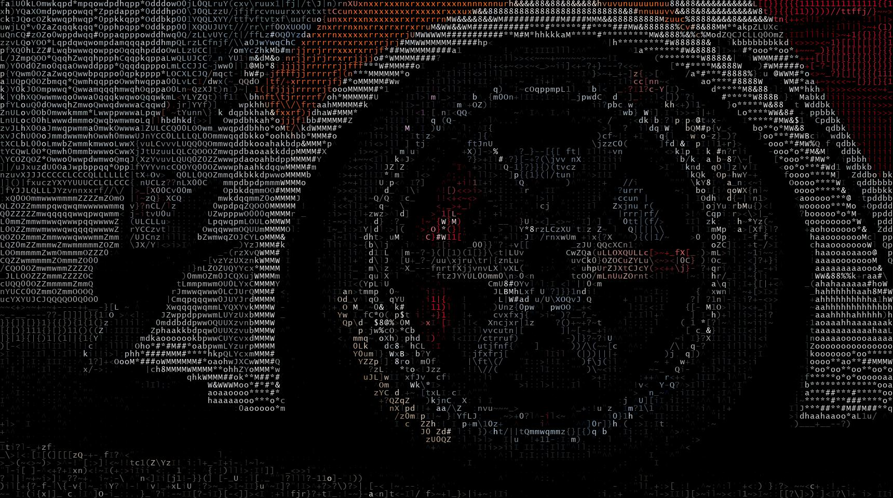
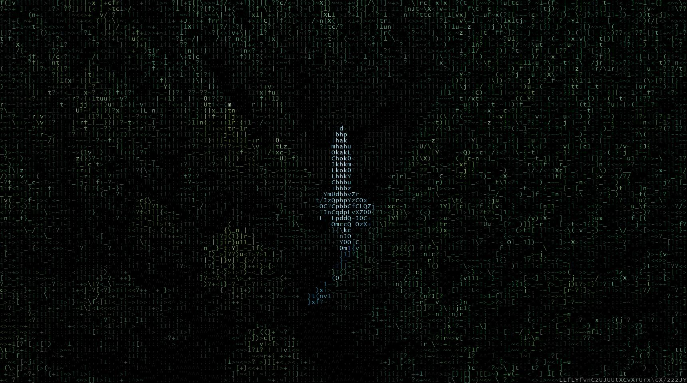
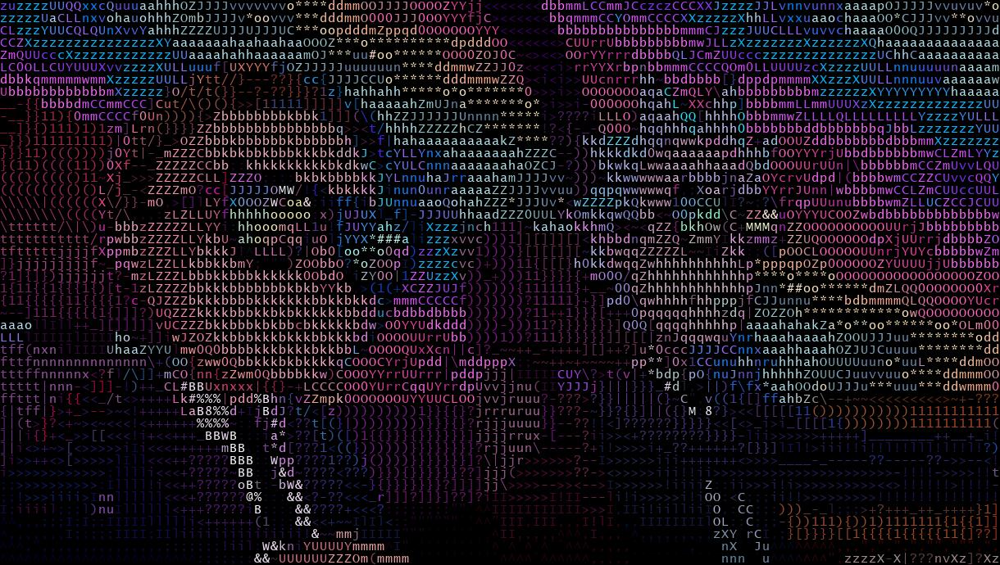
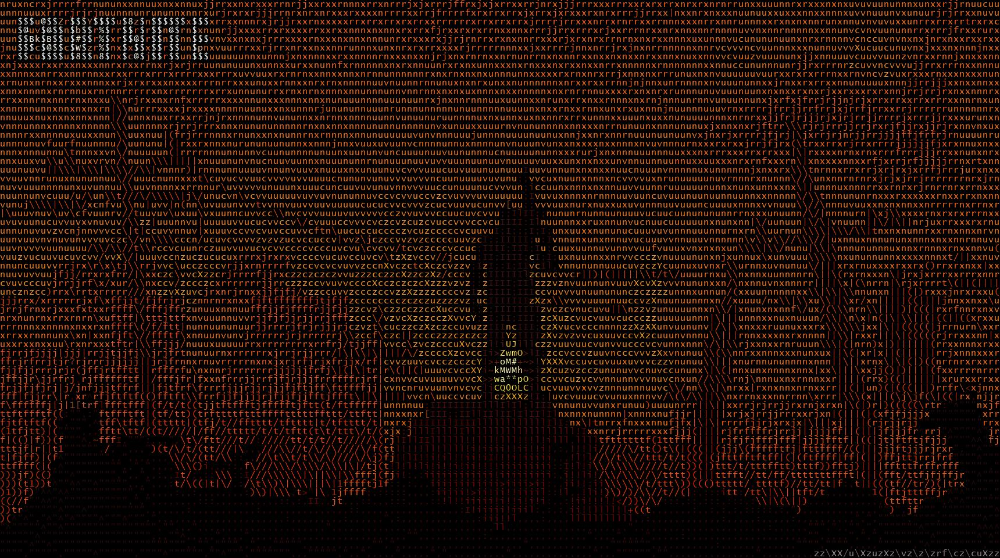
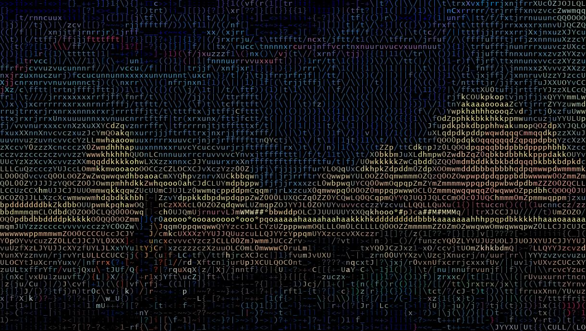
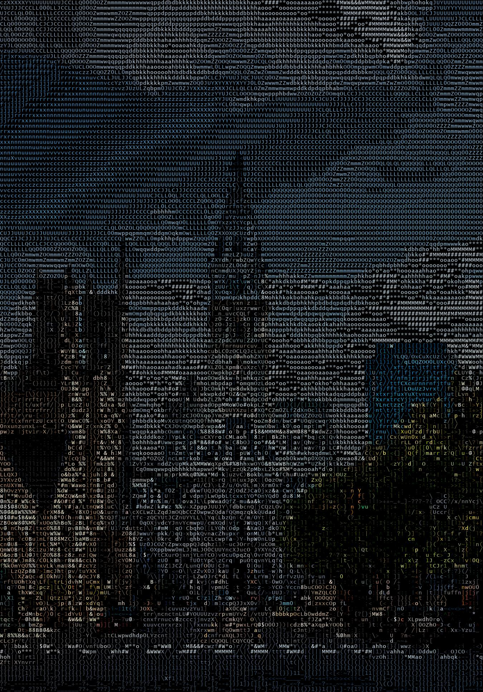

# Imagescii
### Convert high resolution images to amazing looking Ascii Arts
* A simple & powerful tool that lets you convert, your high definition and high resolution images, to amazing ASCII Art images

## Screenshots & sample results
<table>
    <tr>
        <td><strong>Fig-1</strong> Homepage UI</td>
        <td><strong>Fig-2</strong> Homepage UI</td>
    </tr>
    <tr>
        <td valign="top"></td>
        <td valign="top"></td>
    </tr>
    <tr>
        <td><strong>Fig-3.1</strong> Input 1</td>
        <td><strong>Fig-3.2</strong> Output 1</td>
    </tr>
    <tr>
        <td valign="top"></td>
        <td valign="top"></td>
    </tr>
    <tr>
        <td><strong>Fig-4.1</strong> Input 2</td>
        <td><strong>Fig-4.2</strong> Output 2</td>
    </tr>
    <tr>
        <td valign="top"></td>
        <td valign="top"></td>
    </tr>
    <tr>
        <td><strong>Fig-5.1</strong> Input 3</td>
        <td><strong>Fig-5.2</strong> Output 3</td>
    </tr>
    <tr>
        <td valign="top"></td>
        <td valign="top"></td>
    </tr>
    <tr>
        <td><strong>Fig-6.1</strong> Input 4</td>
        <td><strong>Fig-6.2</strong> Output 4</td>
    </tr>
    <tr>
        <td valign="top"></td>
        <td valign="top"></td>
    </tr>
    <tr>
        <td><strong>Fig-7.1</strong> Input 5</td>
        <td><strong>Fig-7.2</strong> Output 5</td>
    </tr>
    <tr>
        <td valign="top"></td>
        <td valign="top"></td>
    </tr>
    <tr>
        <td><strong>Fig-8.1</strong> Input 6</td>
        <td><strong>Fig-8.2</strong> Output 6</td>
    </tr>
    <tr>
        <td valign="top"></td>
        <td valign="top"></td>
    </tr>
    <tr>
        <td><strong>Fig-9.1</strong> Input 7</td>
        <td><strong>Fig-9.2</strong> Output 7</td>
    </tr>
        <tr>
        <td valign="top"></td>
        <td valign="top"></td>
    </tr>
</table>

## Technology Stack
* Front End
    * HTML
    * CSS
    * Javascript
* Back End
    * Flask (Python Web Framework) as Server
    * Python

## Run
* Hit **python server.py** & visit **localhost:5000/**
