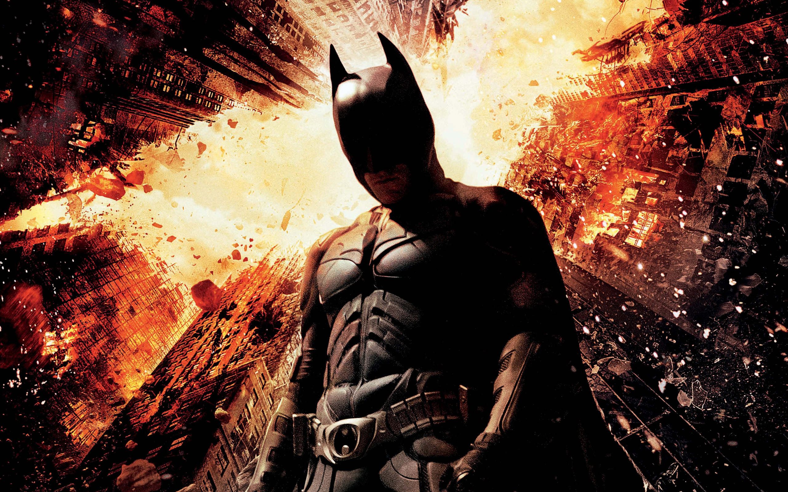

# Imagescii
### Convert high resolution images to amazing looking Ascii Arts
* A simple & powerful tool that lets you convert, your high definition and high resolution, to amazing ASCII Art image

## Screenshots & sample results
 
 
 
 
 
 
 
 

## Technology Stack
* Front End
    * HTML
    * CSS
    * Javascript
* Back End
    * Flask (Python Web Framework) as Server
    * Python

## Run
* Hit **python server.py** & visit **localhost:5000/**